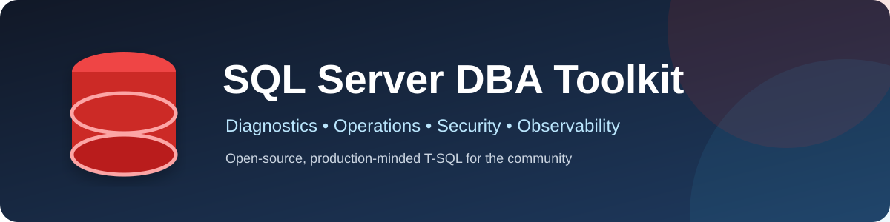
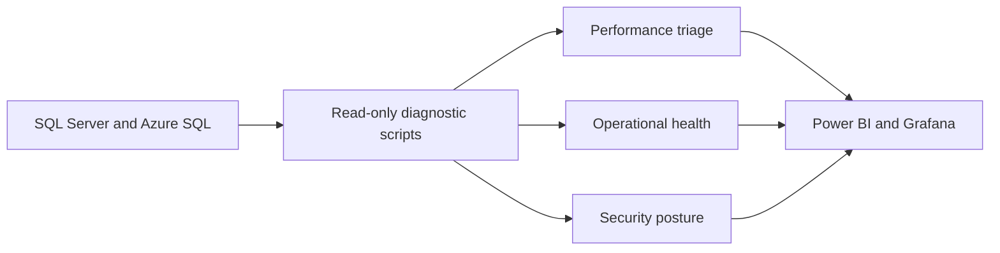
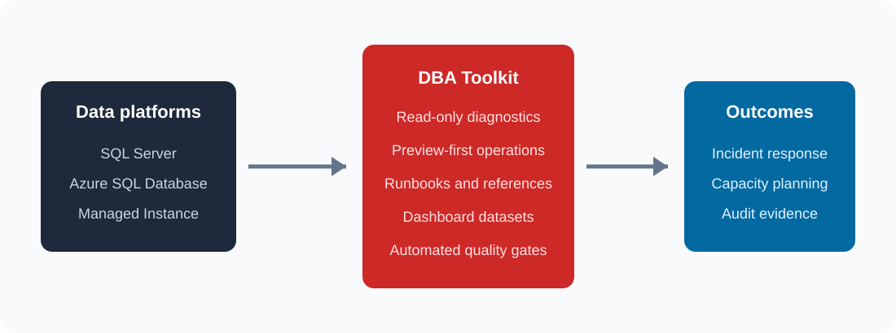
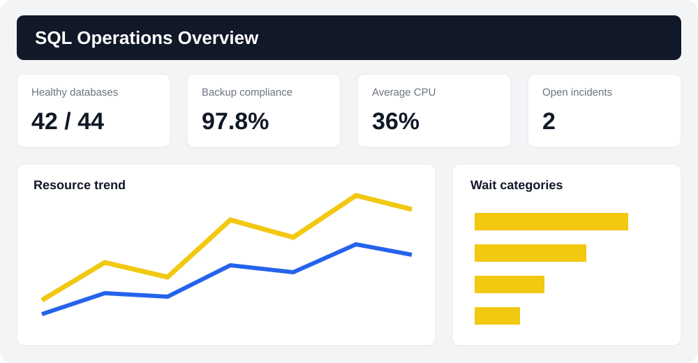
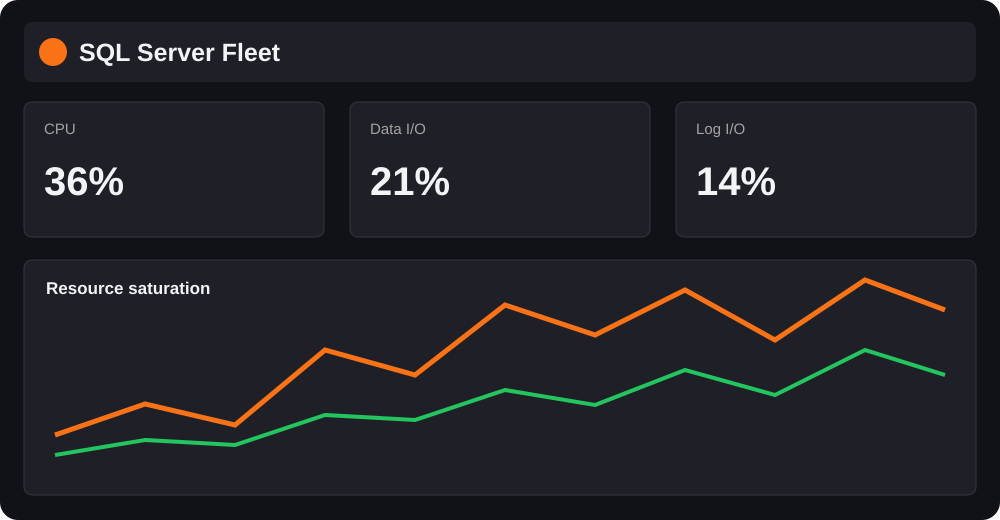

<p align="center">
  
</p>

<p align="center">
  <a href="https://github.com/viperconsultoria-hub/sqlserver-dba-toolkit/actions/workflows/lint.yml"></a>
  <a href="https://github.com/viperconsultoria-hub/sqlserver-dba-toolkit"></a>
  <a href="https://github.com/viperconsultoria-hub/sqlserver-dba-toolkit/blob/main/LICENSE"></a>
  <a href="https://learn.microsoft.com/en-us/sql/sql-server/what-s-new-in-sql-server-2022"></a>
  <a href="https://github.com/viperconsultoria-hub/sqlserver-dba-toolkit/graphs/contributors"></a>
  <a href="https://github.com/viperconsultoria-hub/sqlserver-dba-toolkit/releases"></a>
  <a href="ROADMAP.md"></a>
</p>

# SQL Server DBA Toolkit

A community-driven collection of production-minded T-SQL diagnostics, operational checklists, and dashboard queries for Microsoft SQL Server and Azure SQL.

> [!IMPORTANT]
> Most scripts are read-only. Scripts capable of changing state default to preview mode and are clearly marked. Always test in a non-production environment and review the generated commands.

## Table of contents

- [Why this toolkit](#why-this-toolkit)
- [Features](#features)
- [Quick start](#quick-start)
- [Installation](#installation)
- [Examples](#examples)
- [Dashboards](#dashboards)
- [Repository map](#repository-map)
- [Compatibility and permissions](#compatibility-and-permissions)
- [Contributing](#contributing)
- [FAQ](#faq)
- [Support and security](#support-and-security)
- [Donation](#donation)
- [Roadmap](#roadmap)
- [Acknowledgements](#acknowledgements)
- [License](#license)

## Why this toolkit

Operational SQL knowledge is often scattered across private snippets and one-off incident notes. This project turns those techniques into reviewed, discoverable, parameterized scripts with consistent metadata and safe defaults.



## Features

| Area | What is included |
| --- | --- |
| Performance | CPU, I/O, memory grants, plan cache, Query Store, statistics, and index diagnostics |
| Monitoring | Sessions, waits, blocking, deadlocks, transactions, files, TempDB, CPU, memory, and I/O |
| Data protection | Backup/restore history, coverage, verification templates, compression, encryption, and recovery models |
| Maintenance | Safe command generation for indexes, statistics, integrity checks, and consistency analysis |
| Security | Logins, users, role membership, permissions, auditing, TDE, certificates, and failed logins |
| High availability | Availability Group health, synchronization, latency, replicas, clusters, and failover readiness |
| Cloud | Azure SQL resource governance, Query Store, automatic tuning, and service-objective diagnostics |
| Visualization | Ready-to-import datasets and implementation guides for Power BI and Grafana |

## Quick start

Clone the repository and open a script in SQL Server Management Studio, Azure Data Studio, `sqlcmd`, or your preferred SQL client:

```bash
git clone https://github.com/viperconsultoria-hub/sqlserver-dba-toolkit.git
cd sqlserver-dba-toolkit
```

For example, connect to the target instance and run:

```bash
sqlcmd -S localhost -E -d master -i scripts/performance/top-cpu-queries.sql
```

Review the permissions and scope in the script header. Server-level DMVs commonly require `VIEW SERVER STATE` on SQL Server 2019 and earlier, or `VIEW SERVER PERFORMANCE STATE` on SQL Server 2022 and later.

## Installation

No server-side installation is required. Download only the scripts you need, clone the repository, or consume a versioned release archive. See the complete [installation guide](docs/installation.md).

## Examples

- [Five-minute health check](examples/five-minute-health-check.md)
- [Performance incident workflow](examples/performance-incident.md)
- [Backup compliance workflow](examples/backup-compliance.md)

Common starting points:

```sql
-- Find the cached statements with the highest total worker time.
-- Run in the context of the instance you want to inspect.
:r scripts/performance/top-cpu-queries.sql
```

```sql
-- Preview fragmented-index maintenance commands.
-- The script does not execute changes unless @Execute = 1.
:r scripts/maintenance/rebuild-indexes.sql
```

## Screenshots

The project ships lightweight SVG previews that render directly on GitHub:



## Dashboards

### Power BI dashboard

Use the curated queries in [`dashboards/powerbi`](dashboards/powerbi/) as datasets, then follow the [Power BI guide](docs/powerbi.md) to define refresh, relationships, measures, and least-privilege access.



### Grafana dashboard

Use the time-series queries in [`dashboards/grafana`](dashboards/grafana/) with the Microsoft SQL Server data source. Provisioning, variables, alerting, and troubleshooting are covered in the [Grafana guide](docs/grafana.md).



## Repository map

```text
.
├── .github/                 # CI, issue, and pull request automation
├── dashboards/             # Power BI and Grafana query datasets
├── docs/                   # Topic-oriented operational guides
├── examples/               # End-to-end incident and compliance workflows
├── images/                 # Architecture and dashboard SVG previews
└── scripts/
    ├── performance/        # Query and plan analysis
    ├── indexes/            # Index and statistics diagnostics
    ├── monitoring/         # Sessions, growth, connections, transactions
    ├── blocking/           # Blocking and lock analysis
    ├── deadlocks/          # Extended Events deadlock extraction
    ├── waits/              # Wait and latch statistics
    ├── tempdb/             # TempDB allocation and configuration
    ├── backup/             # Backup and restore posture
    ├── maintenance/        # Preview-first maintenance operations
    ├── security/           # Authentication and encryption
    ├── permissions/        # Effective access and principal inventory
    ├── auditing/           # Audit configuration and events
    ├── availability_groups/# Availability Group diagnostics
    ├── alwayson/           # Cluster and failover diagnostics
    ├── jobs/               # SQL Server Agent health
    ├── memory/             # Memory pressure and grants
    ├── cpu/                # Scheduler and CPU analysis
    ├── io/                 # File and I/O latency analysis
    └── azure/              # Azure SQL-specific diagnostics
```

## Compatibility and permissions

| Target | Support |
| --- | --- |
| SQL Server 2016–2022 | Core target; individual headers identify version-specific features |
| SQL Server 2025 | Expected to work where documented DMVs remain compatible; validation is ongoing |
| Azure SQL Database | Supported by scripts under `scripts/azure` and compatible database-scoped scripts |
| Azure SQL Managed Instance | Most instance diagnostics apply; check each script header |

Grant diagnostic permissions to a dedicated operations identity instead of using `sysadmin`. Never grant broader permissions solely to make a script convenient.

## Contributing

Contributions of scripts, tests, documentation, dashboard improvements, and translations are welcome. Start with [CONTRIBUTING.md](CONTRIBUTING.md), follow the [Code of Conduct](CODE_OF_CONDUCT.md), and use the pull request template.

Suggested GitHub topics: `sql-server`, `mssql`, `database`, `dba`, `performance`, `monitoring`, `azure-sql`, `powerbi`, `grafana`, `devops`, `sql`, `administration`, `tuning`, `query-performance`, `indexes`, `backup`, `security`.

## FAQ

### Are the scripts safe to run in production?

Read-only scripts are designed for low-friction diagnostics, but every DMV query has some cost. Test first, use restrictive filters, and avoid frequent polling on overloaded systems. State-changing scripts default to preview mode.

### Why do some results reset after a restart?

Many DMVs expose cumulative values since startup, failover, cache eviction, or database scope reset. Correlate the output with `sqlserver_start_time` and persist snapshots when trends matter.

### Does a missing-index recommendation mean I should create the index?

No. Treat it as evidence, not a command. Compare existing indexes, write overhead, Query Store history, and representative execution plans before changing schema.

### Can I use these scripts with Azure SQL Database?

Yes, when the underlying DMV is available and permissions are database scoped. Prefer the scripts in [`scripts/azure`](scripts/azure/) and read their compatibility notes.

## Support and security

- Ask usage questions in [GitHub Discussions](https://github.com/viperconsultoria-hub/sqlserver-dba-toolkit/discussions).
- Report reproducible bugs with the [issue template](https://github.com/viperconsultoria-hub/sqlserver-dba-toolkit/issues/new).
- Follow the private reporting process in [SECURITY.md](SECURITY.md) for vulnerabilities.

Community support is best-effort. This toolkit is not a replacement for a tested backup, recovery, security, or incident-response plan.

## Donation

The project does not currently accept financial donations. The most valuable contributions are reproducible bug reports, tested scripts, documentation improvements, reviews, stars, and constructive feedback.

## Roadmap

The staged plan covers a stable v1.0 catalog, richer cloud observability in v1.1, automation and container platforms in v2.0, and a broader data-platform observability layer in v3.0. See [ROADMAP.md](ROADMAP.md).

## Acknowledgements

Thanks to the SQL Server community, Microsoft Learn authors, maintainers of community linters, and every contributor who turns operational experience into reusable knowledge. Microsoft, SQL Server, Power BI, Azure, and related marks belong to their respective owners.

## License

Released under the [MIT License](LICENSE).
