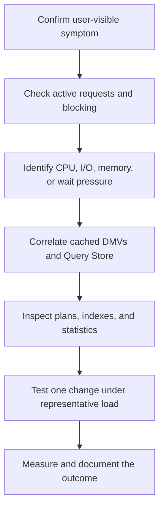

# Performance diagnostics

## Introduction

Performance analysis is evidence-driven: establish the time window, identify the constrained resource, find the workload responsible, and validate a change against representative load.

## Objective

Use DMVs and Query Store to move from a symptom to a defensible hypothesis without immediately changing configuration or schema.

## Prerequisites

- `VIEW SERVER STATE` on SQL Server 2019 and earlier, or `VIEW SERVER PERFORMANCE STATE` on SQL Server 2022 and later, for server DMVs.
- `VIEW DATABASE STATE` for database-scoped diagnostics.
- Query Store enabled for historical query analysis.
- A known incident time window and workload baseline.

## Workflow

## Examples

Start with:

1. `scripts/monitoring/current-sessions.sql`
2. `scripts/waits/wait-statistics.sql`
3. `scripts/performance/top-cpu-queries.sql` or `top-io-queries.sql`
4. `scripts/performance/query-store-regressions.sql`
5. Relevant scripts under `scripts/indexes`, `scripts/memory`, `scripts/cpu`, or `scripts/io`.

Interpret cumulative DMV values relative to startup and plan-cache age. A high total does not imply a current problem; compare total, average, execution count, and recency.

## Best practices

- Capture a baseline before incidents.
- Prefer Query Store for durable history.
- Validate cardinality estimates and parameter sensitivity in actual plans.
- Consolidate overlapping indexes instead of applying every recommendation.
- Change one variable at a time and define rollback criteria.
- Never clear caches merely to improve a report.

## Troubleshooting

| Observation | Investigation |
| --- | --- |
| High CPU, low I/O | Expensive computations, scans in memory, compilation, parallelism |
| High PAGEIOLATCH waits | Physical reads, storage latency, memory pressure, scan-heavy plans |
| High RESOURCE_SEMAPHORE | Excessive memory grants, concurrency, poor estimates |
| Intermittent regression | Query Store plan changes, parameter sensitivity, statistics updates |
| Good query metrics but slow users | Blocking, network, client consumption, or external dependencies |

## Microsoft references

- [Monitor performance with Query Store](https://learn.microsoft.com/en-us/sql/relational-databases/performance/monitoring-performance-by-using-the-query-store)
- [Query processing architecture guide](https://learn.microsoft.com/en-us/sql/relational-databases/query-processing-architecture-guide)
- [Index architecture and design guide](https://learn.microsoft.com/en-us/sql/relational-databases/sql-server-index-design-guide)
- [Statistics](https://learn.microsoft.com/en-us/sql/relational-databases/statistics/statistics)
