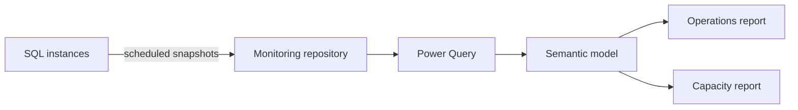

# Power BI integration

## Introduction

Power BI can turn retained SQL operational snapshots into capacity, reliability, and performance views. Directly polling expensive DMVs from many reports is not recommended.

## Objective

Build a governed semantic model over a small monitoring repository populated by scheduled, least-privilege collectors.

## Prerequisites

- Power BI Desktop and an approved Power BI workspace.
- SQL connectivity through an on-premises data gateway when required.
- A read-only reporting identity.
- Retained snapshots with UTC timestamps and stable schemas.

## Architecture



## Example datasets and metrics

Start with the queries in `dashboards/powerbi`.

| Metric | Definition | Use |
| --- | --- | --- |
| Backup age | Current UTC time minus latest successful backup finish | RPO compliance |
| Data used percent | Used pages divided by allocated pages | Capacity pressure |
| Average I/O latency | Stall milliseconds divided by I/O operations | Storage trend |
| Wait share | Wait time divided by total non-idle wait time | Bottleneck mix |

Example DAX measure:

```dax
Backup Age Hours =
DATEDIFF(MAX(BackupSnapshot[LastBackupFinishUtc]), UTCNOW(), HOUR)
```

## Best practices

- Import from a monitoring repository instead of repeatedly querying live DMVs.
- Use incremental refresh and UTC.
- Separate facts from instance, database, and time dimensions.
- Apply row-level security when operational scope differs by team.
- Document counter reset semantics and units in measure descriptions.
- Mask query text and principal names unless explicitly required.

## Troubleshooting

Gateway failures commonly involve DNS, TLS trust, identity delegation, firewall rules, or an offline gateway. Refresh slowness usually calls for incremental refresh, source-side aggregation, query folding, and narrower retention.

## Microsoft references

- [Connect Power BI to SQL Server](https://learn.microsoft.com/en-us/power-bi/connect-data/service-gateway-sql-tutorial)
- [SQL Server connector](https://learn.microsoft.com/en-us/power-query/connectors/sql-server)
- [Incremental refresh](https://learn.microsoft.com/en-us/power-bi/connect-data/incremental-refresh-overview)
